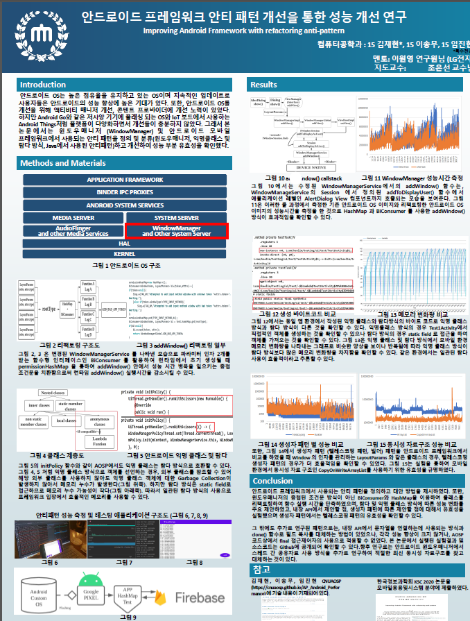
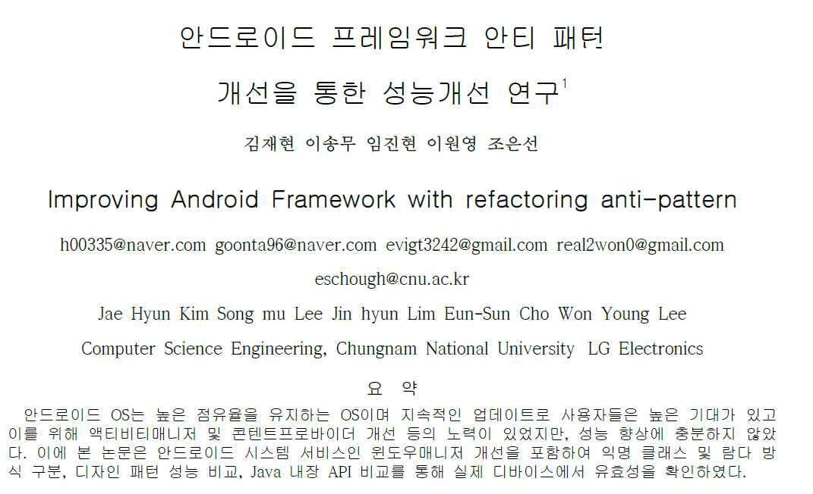

<h1 align="center">project Arducontroller</h1>

<p align="center">
  <a href="https://opensource.org/licenses/Apache-2.0"></a>
  <a href="https://android-arsenal.com/api?level=24"></a>
  <a href="https://github.com/keelim/project_ArduController/actions"></a> 
</p>
<p align="center">  
기존 아두이노를 조작하는 어플리케이션에서 프로젝트가 시작을 하였으나 안드로이드 OS 에서 하드웨어 기능을 살리는 여러가지 Feature 를 중심으로 안드로이드 서브 프로젝트를 구성하여 멀티 모듈을 통해 통합을 진행하고 있다. 또한, 기존 WindowManager 에 관한 연구에서 사용된 성능 측정 앱 또한, 통합 과정 진행 중이다.
</p>







## Tech stack & Open-source libraries
- Minimum SDK level 24
- [Kotlin](https://kotlinlang.org/) based, [introducing Coroutines](https://github.com/Kotlin/kotlinx.coroutines) 
- JetPack
  - LiveData - notify domain layer data to views.
  - Lifecycle - dispose of observing data when lifecycle state changes.
  - ViewModel - UI related data holder, lifecycle aware.
  - RecyclerView 
  - navigation 
- Architecture
  - MVVM Architecture (View - DataBinding - ViewModel - Model)
  - etc ViewBinding
- [Timber](https://github.com/JakeWharton/timber) - logging.1
- [Material-Components](https://github.com/material-components/material-components-android) - Material design components like ripple animation, cardView.
- [Firebase](https://firebase.google.com/) - save lab data with FireStore 
- [spotless](https://github.com/diffplug/spotless) - for ktlint
- [Git](https://git-scm.com/) - for scm with Git flow strategy
- [Github Actions](https://docs.github.com/en/actions) - for CI/CD (automated playstore(aab))

## MAD Score


## Architecture
Pokedex is based on MVVM architecture and a repository pattern.


# License
```xml
Designed and developed by 2019 keelim (Jaehyun Kim)

Licensed under the Apache License, Version 2.0 (the "License");
you may not use this file except in compliance with the License.
You may obtain a copy of the License at

   http://www.apache.org/licenses/LICENSE-2.0

Unless required by applicable law or agreed to in writing, software
distributed under the License is distributed on an "AS IS" BASIS,
WITHOUT WARRANTIES OR CONDITIONS OF ANY KIND, either express or implied.
See the License for the specific language governing permissions and
limitations under the License.
```